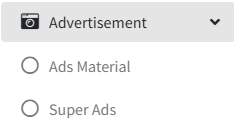
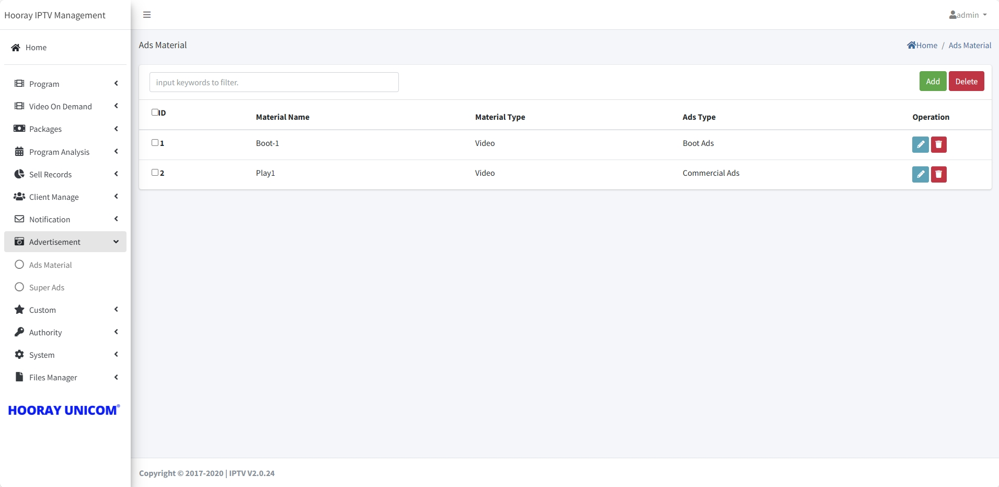
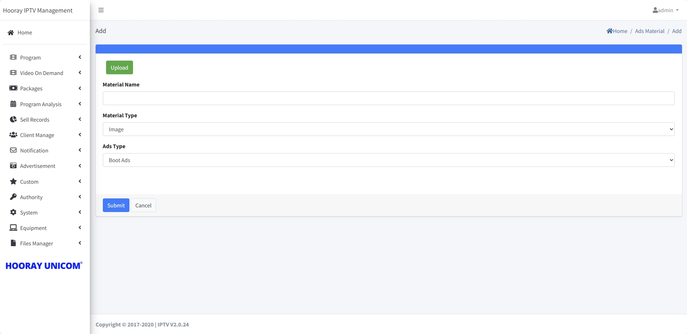
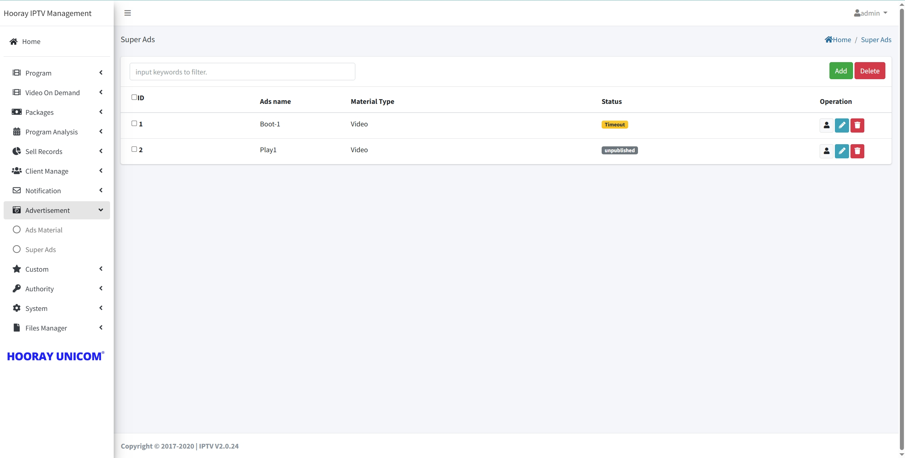
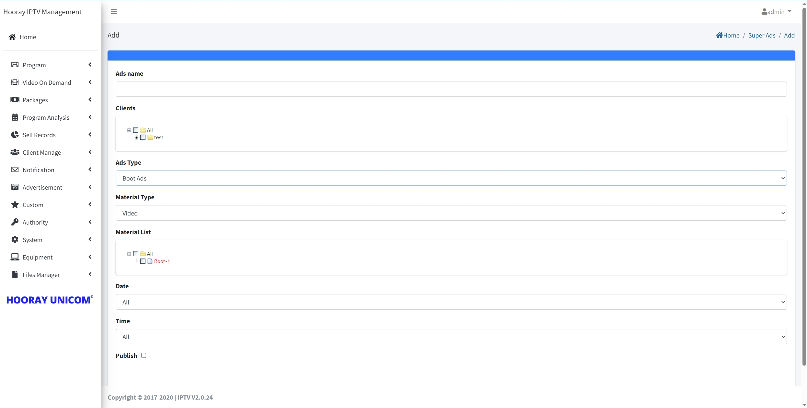

# Ads Setting

>Introduction

 In `Advertisement`, the administrator will upload, delete video and picture materials in `Ads Material` and create, modify, and delete ads in `Super Ads`. The IPTV system currently supports 4 types of ads, `Boot Ads`/`Commercial Ads`/`Side Ads`/`Emergency Ads`.

## Ads Material

>Introduction

In `Ads Material`, the uploaded material will be displayed in the page as a list, and the administrator can manage the material by using the `Add`, `Edit` and `Delete` buttons.

### Ads Material-Add/Edit

>Introduction

Press `Add` button to upload the material to the list.

**Upload** Click the `Upload button1`, the administrator selects the image or video material that needs to be uploaded, and the system will automatically upload the selected material into the system.

**Material Name** Label the `Material Name` with the name of the uploaded material, which will be used in subsequent material selections.

**Material Type** In `Material Type`, the administrator needs to assign whether the uploaded material belongs to the `image` category or `video` category, and select the corresponding category by dropping down.

**Ads Type** In `Ads Type`, the administrator needs to scroll down and select the material to the corresponding ad type. there is 4 ad types to select, make sure you select the right ad type to work.

### Ads Material-Delete

 Press `Del` button to del uploaded material from list, when the material del and the Ads still working, the terminal side will not receive the material.

## Super Ads

>Introduction

In Super Ads page, administrator needs to create, edit and delete 4 different categories of ads, 4 types of ads are `boot ads`, `Commerical ads`, `side ads` and `emergency ads`.

**Boot Ads**: If there are startup ads in the subscriber group, when the app starts, the app will show picture or video ads first before entering the login screen.

**Commerical Ads**: If there are playing ads in the subscriber group, when the subscriber plays a live or on-demand program, the subscriber needs to finish playing the video ads before he/she can watch the live or on-demand program.

**Side Ads**: When there are ads in the subscriber group, when the subscriber is playing a live program, the picture ads will appear in the live screen, and the ads will appear on one side of the screen and the live program on the other side of the screen.

**Emergency Ads**: All subscribers will receive pictures or videos sent by IPTV system briefly, when emergency pictures or videos are played, regardless of whether the subscriber is watching or not, as long as the subscriber opens the APP, he/she will receive emergency ads.

### Super Ads-Add/Edit

>Introduction

After clicking the `Add` or `Edit` button, the administrator enters the Create or Edit page, where the corresponding information needs to be filled in for the created or modified advertisement.

>Introduction **Boot Ads Setting**

1. **Ads Name**: The `Ads Name` is used to distinguish between different ads.

2. **Clients**: The `Client` selects the subscriber group, and the checked group will enable this advertisement to play.

3. **Ads Type**: Here's `Boot Ads` as an example

4. **Material Type**: In `Material Type`, Boot Ads supports image and video materials, and selecting the corresponding Type indicates the type that the terminal needs to play when opening the APP.

5. **Material List**: In the `Material List`, select the corresponding advertisement material by checking it.

6. **Date**: In `Date`, the administrator can specify the start date and end date of the advertisement.

7. **Time**: In `Time`, the administrator can specify the start time and end time of the advertisement.

8. **Publish**: After checking `Pulish`, the advertisement will start to send, if Date and Time have been set, then the advertisement will be processed according to the Date and Time that has been set.

>Introduction **Commercial Ads Setting**

1. **Ads Name**: The `Ads Name` is used to distinguish between different ads.

2. **Clients**: The `Client` selects the subscriber group, and the checked group will enable this advertisement to play.

3. **Ads Type**: Here's `Commercial Ads` as an example

4. **Material Type**: In `Material Type`, Commercial Ads Only supports video.

5. **Program Setting**: In `Program Setting`, In Program Setting, the administrator needs to select whether the advertisement is to be used for live or VOD.

6. **Play Setting**: In `Play Setting`, administrator can select Manual boardcast or Random boardcast, when selecting Manual boardcast, administrator needs to select the advertisement material to be played in Material selection box, if selecting Random boardcast, the terminal will automatically select the advertisement material to be played.

7. **Material**: In the `Material`, select the corresponding advertisement material by checking it.

8. **Date**: In `Date`, the administrator can specify the start date and end date of the advertisement.

9. **Time**: In `Time`, the administrator can specify the start time and end time of the advertisement.

10. **Publish**: After checking `Pulish`, the advertisement will start to send, if Date and Time have been set, then the advertisement will be processed according to the Date and Time that has been set.

11. **Turn on channel switching**: In `Turn on channel switching`, Commercial Ads play when a subscriber switches live channel in a live program or switches VOD in VOD program.

>Introduction **Side Ads Setting**

1. **Ads Name**: The `Ads Name` is used to distinguish between different ads.

2. **Clients**: The `Client` selects the subscriber group, and the checked group will enable this advertisement to play.

3. **Ads Type**: Here's `Side Ads` as an example

4. **Material Type**: In `Material Type`, Side Ads Only supports image.

5. **Program Setting**: In `Program Setting`, In Program Setting, the administrator needs to select whether the advertisement is to be used for live or VOD.

6. **Show Position**: In `Show Position`, administrators need to choose the location of the advertisement picture insertion, currently support the left side, the right side, top side and bottom side insertion, the effect is as shown in the figure.

  <figure style="flex: 1;">
    
    <figcaption>{{ image.title }}</figcaption>
  </figure>

<!--

-->

6. **Interval**: In `Play Setting`, administrator can select Manual boardcast or Random boardcast, when selecting Manual boardcast, administrator needs to select the advertisement material to be played in Material selection box, if selecting Random boardcast, the terminal will automatically select the advertisement material to be played.

7. **Material**: In the `Material`, select the corresponding advertisement material by checking it.

8. **Date**: In `Date`, the administrator can specify the start date and end date of the advertisement.

9. **Time**: In `Time`, the administrator can specify the start time and end time of the advertisement.

10. **Publish**: After checking `Pulish`, the advertisement will start to send, if Date and Time have been set, then the advertisement will be processed according to the Date and Time that has been set.

11. **Turn on channel switching**: In `Turn on channel switching`, Commercial Ads play when a subscriber switches live channel in a live program or switches VOD in VOD program.S