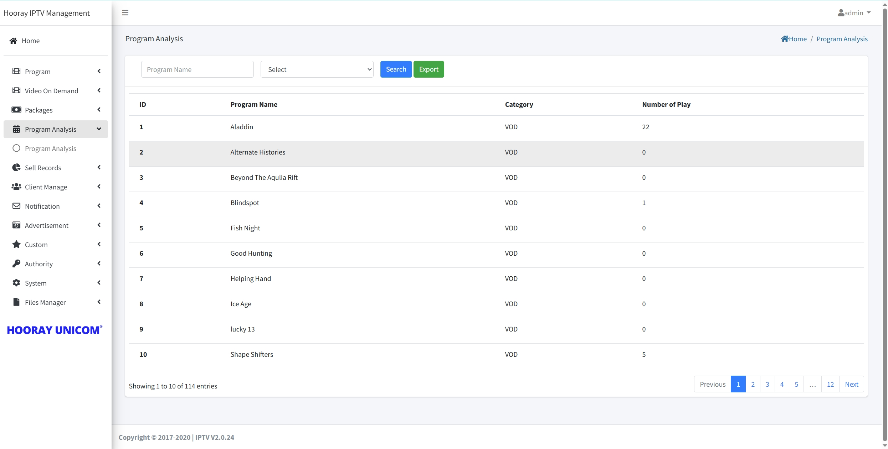
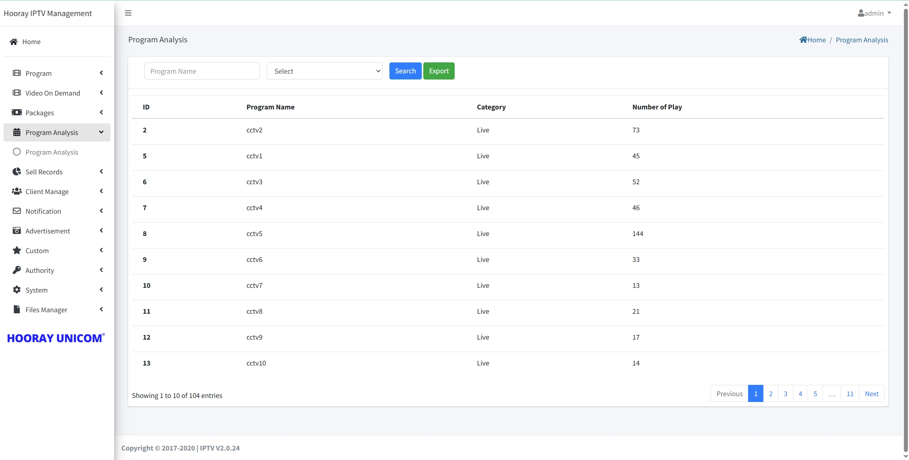
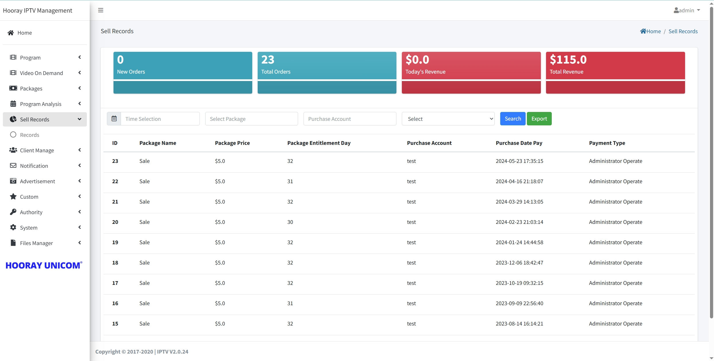

# Analysis Setting

## Program Analysis

>Introduction

In Progmra Analysis, administrators can view the number of live and VOD broadcasts. The `live` and `VOD` program data can be displayed by selecting the Select drop-down box.

## Sell Record

>Introduction

Sell Record displays the subscriber's package purchase history, including third-party API purchases and administrator-activated package purchases. The administrator can query the record information of the specific subscriber or the time of purchase by the query conditions.