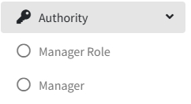
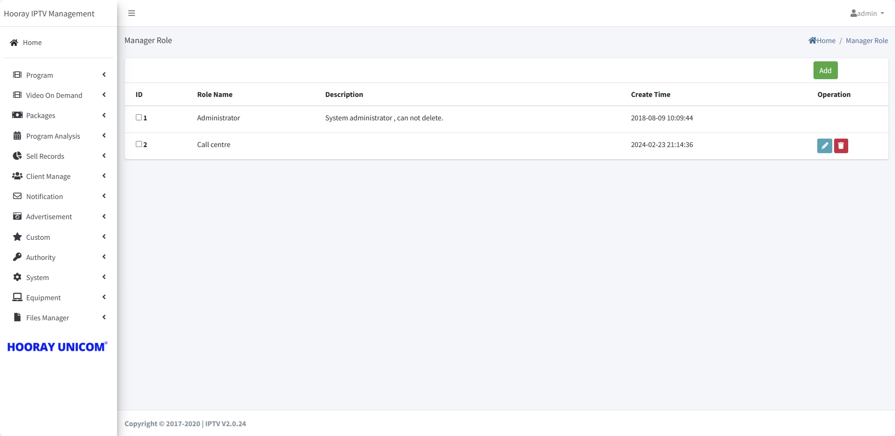
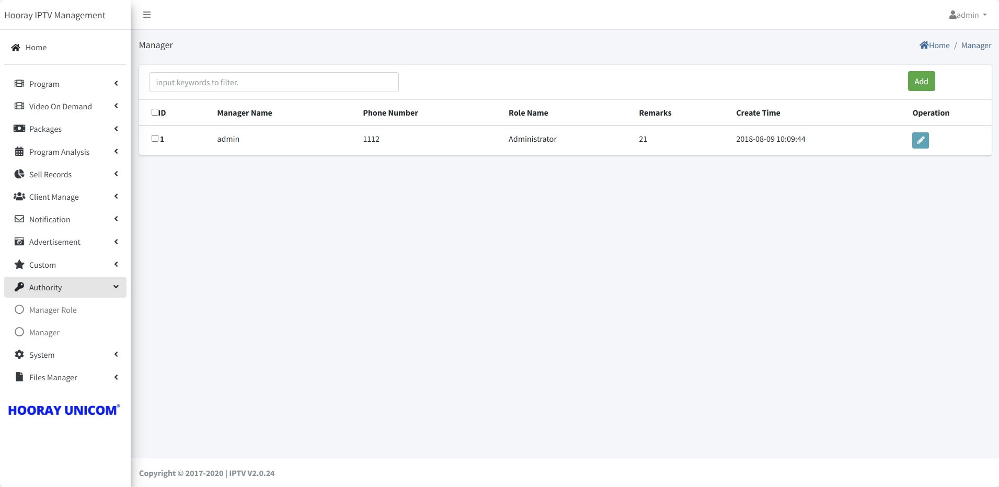
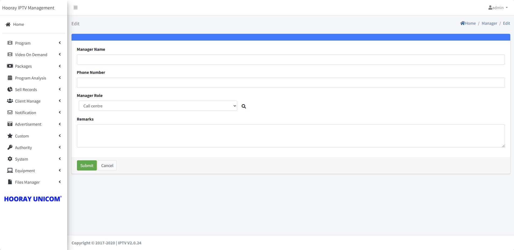

# Authority Setting

>Introduction

 

In `Authority`, the Super Administrator needs to create corresponding accounts and assign administrative roles to the administrators logging into the IPTV system.

## Manager Role Setting

>Introduction

In `Manager Role`, system administrators can view the list of created manager roles, in which the system administrator role cannot be deleted, and system administrators can add, modify and delete manager roles in this page.

!> :warning: **Warning: system administrator role cannot be deleted**

 

Press `Add` button to create the manager role

 

**Role Name**: In `Role Name`, the administrator sets the administrative role name, which is used to distinguish between different administrative roles.

**Description**: In `Description`, the administrator sets the corresponding administrative role description information, which is used to describe what permissions the role has.

**Authority**: In Authority, the administrator needs to check the permissions that this administrative role has. Permissions can be divided up into View/Add/Edit/Delete

**Remarks**: In `Remark`, the administrator fills in the information that needs to be remarked for that role.

## Manager

>Introduction

In `Manger`, system administrators or administrators with Authority Setting privileges can manage administrator accounts. In the list of administrator accounts, you can view the created administrator accounts, and you can add, edit and delete the corresponding administrator accounts.

Press `Add` button to create the manager account

**Manager Name**: In `Manager Name`, the administrator sets the administrative account name, which is used to distinguish between different administrative account.

**Phone Number**: In `Phone Number`, the administrator fills in the corresponding mobile phone number, which has clarified the contact information of the person to whom the account belongs.

**Manager Role**: In `Manager Role`, the administrator drops down to select the created management role, and the classification corresponds to the role given to that administrator account.

**Remarks**: In `Remark`, the administrator fills in the information that needs to be remarked for that account.