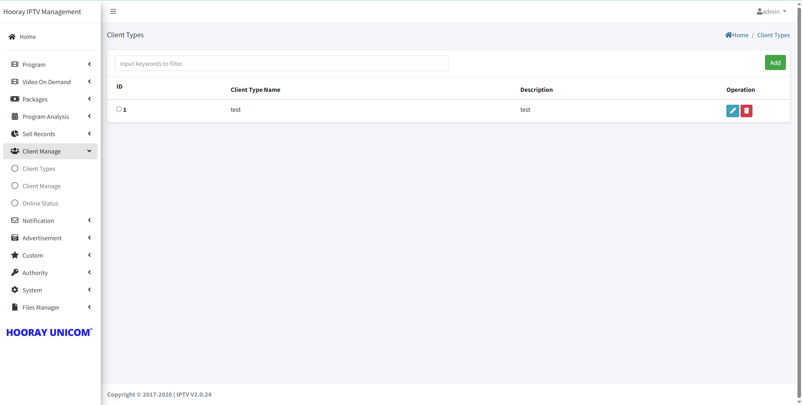
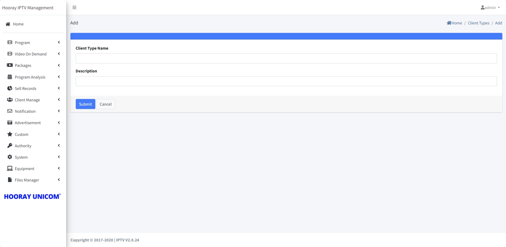
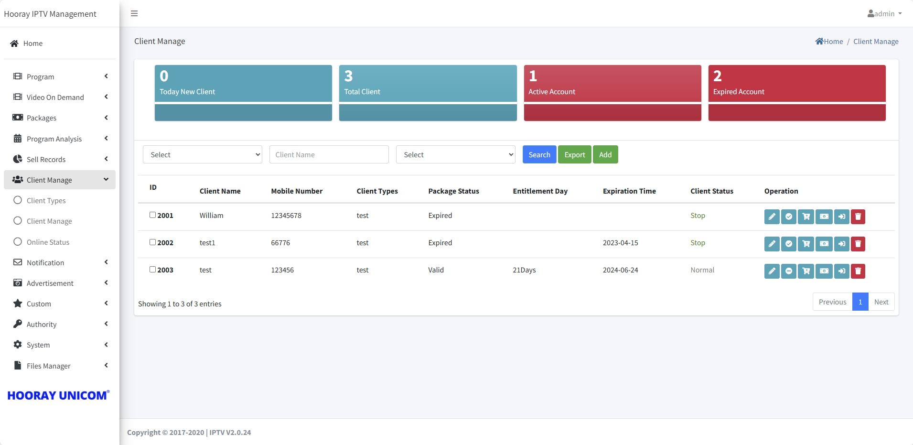

# Client Management Setting

The `Client menu` allows administrators to create, modify, and delete `Client Type`, create and control the client account in `Client Manage`, and check the client operate status in `Client Status`

## Client Type

>Introduction

In `Client Type`, the Client Type is created in order to differentiate between different client categories and facilitate subsequent operation management. For example, OTA upgrade, scrolling subtitle sending, advertisement distribution, etc.

Press `Add` button to create the `Client Type`

1. **Client Type Name**: In `Client Type Name`, the name used to distinguish between different subgroups.

2. **Description**: In `Description`, used to describe the different client types.

## Client Manage

>Introduction

