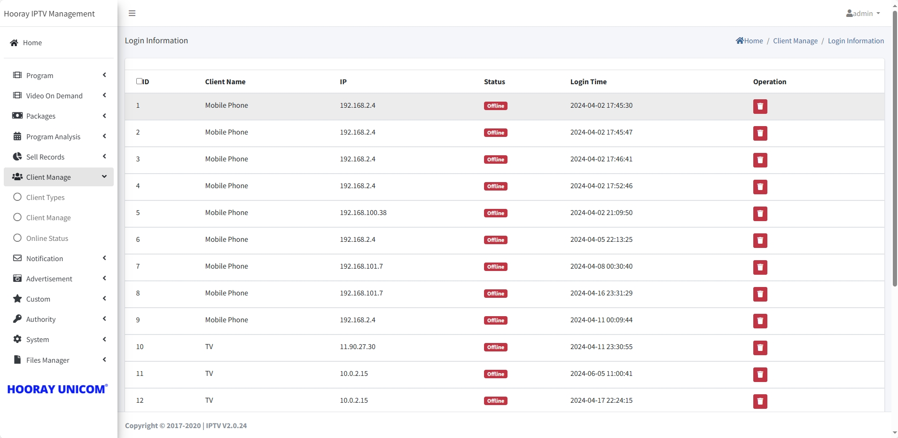

# Client Management Setting

>Introduction

The `Client menu` allows administrators to create, modify, and delete `Client Type`, create and control the client account in `Client Manage`, and check the client operate status in `Client Status`

## Client Type

>Introduction

In `Client Type`, the Client Type is created in order to differentiate between different client categories and facilitate subsequent operation management. For example, OTA upgrade, scrolling subtitle sending, advertisement distribution, etc.

Press `Add` button to create the `Client Type`

1. **Client Type Name**: In `Client Type Name`, the name used to distinguish between different subgroups.

2. **Description**: In `Description`, used to describe the different client types.

## Client Manage

>Introduction

`Client Manage`is the core page for managing subscribers, which is responsible for creating, editing and deleting subscriber accounts, opening and closing subscriber account status, viewing, purchasing and canceling subscriber packages, deleting and binding subscriber login device information, and a series of other operations.

### Statistical information

**Today New Client** `Today New Client` counts the number of subscribers registered for the day.

**Total Client** `Total Client` counts all registered subscribers in the system.

**Active Account** `Active Account` counts all subscribers in the system who have purchased a package.

**Expired Account** `Expired Account` counts all subscribers in the system who have not purchased a package or whose package has expired.

### Client Account Add

Press `Add` button to create new client account from web.

1. **Client Name**:  when the administrator creates a subscriber account, the `Client Name` is the login account.

2. **Password**: The `Password` is used to login the IPTV service.

3. **Mobile Number**: The `Mobile Number` is  used to identify the cell phone number bound to the current account

4. **User ID**: The `User ID` number is used to identify the identity information bound to the current account

5. **Home Address**: The `Home Address` is used to identify the home address to which the current account is bound

6. **Client Types**: The `Client Type` is used to identify the category to which the current account belongs

7. **Numbers of Terminal**: The `Number of Terminals` is used to identify the maximum number of online devices supported by the current account. If the number of online devices in the account exceeds the number of terminals, the account will be randomly selected and forced to take down the devices that are already online.

### Client Account Edit

Press `Edit` button to edit the selected account from client list, in `Edit` page, administrator can edit all the client information include the `login password` and `numbers of terminal`

### Client Account Delete

Clicking on the `Delete` button will delete the client account.

!> :warning: **Warning: Accounts cannot be retrieved after deletion.**

### Client Account Status

Press `Stop` or `Start` icon to control the client account status, which will 

### Buying Package for Client

The administrator performs package authorization operations for subscribers by clicking on this icon.

1. **Buying package**: Scroll down to select the package that needs to be authorized for the current customer, select it and click the Submit button to submit it.

### Purchase History

Click on the `Purchase Hisotry` button to enter the page to view and delete the subscriber's package purchase history.

### Login Information

Click the `Login Information` button to enter the page to view the user's login device information record. 管理员可以

In this page, the administrator can view the online and offline status of the device and delete the corresponding login device information.

## Online Status

>Introduction

Administrators can view the current online account status and the number of device logins in `Online Status`, and click the corresponding account to view the operation records and online hours of each device under the account.

