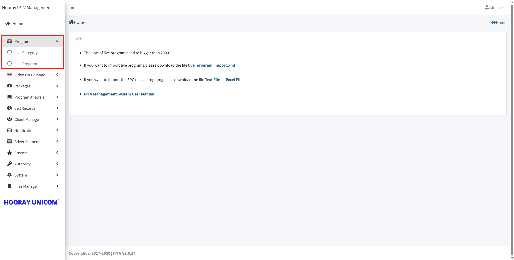
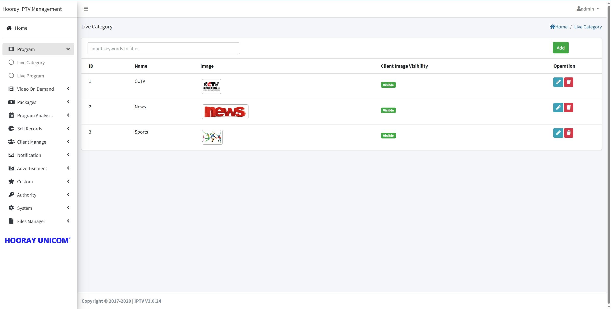
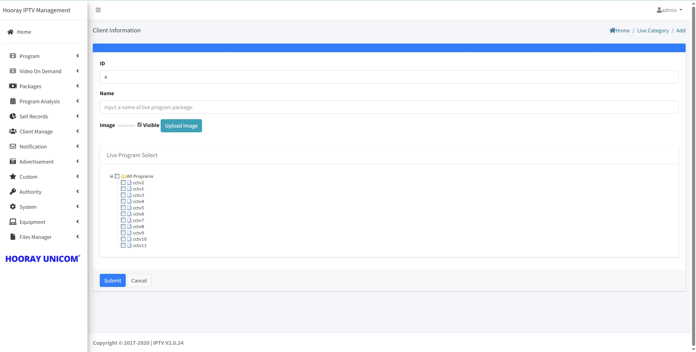
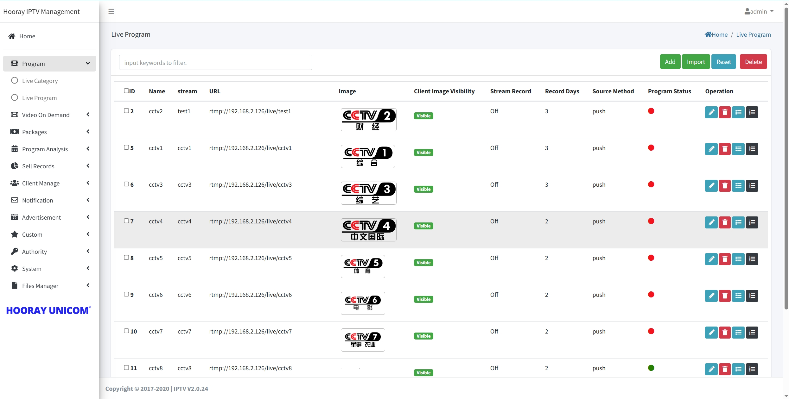
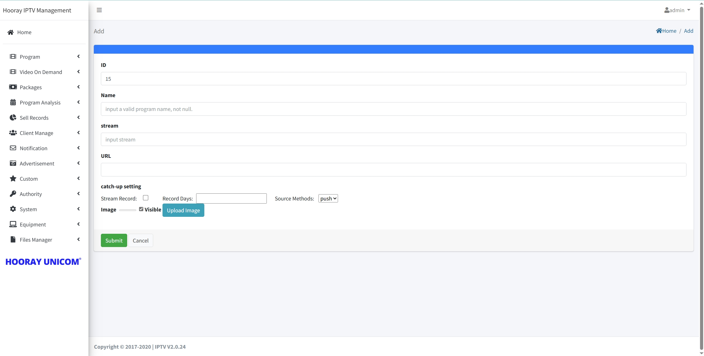
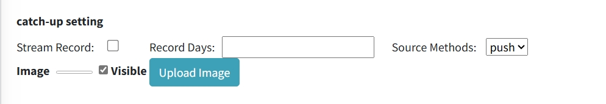

# Live Setting

>Introduction

The program menu allows administrators to create, modify, and delete `Live Category` and `Live Program` settings.

## Live Category

>Introduction

In the Live Category feature, administrators can create, modify, and delete categories for live channel sources. By creating Live categories, administrators can better organize and associate the corresponding live channel sources with the respective categories. This allows subscribers to conveniently search and categorize the live channels they want to watch.

Administrators can create new live categories by clicking on the `Add` button. Each channel category needs to be associated with a corresponding live channel source; each channel category can upload poster to specify their different.

1. **ID**: The `ID` is automatically generated by the system, the smaller the ID is, the higher it is displayed in the live category, you can adjust the ID in the edit page to arrange the order of different categories.

2. **Name**: The `Name` distinguishes between different categorical names.

3. **Image**: By uploading the corresponding category `images`, the `image` will be displayed on the set-top box live category menu.

4. **Live Program Select**: To `select` the corresponding live program to the specified live category, the administrator needs to select the corresponding live program to the current live category, and the selected live program will be displayed under the corresponding category in the terminal live category menu.

!>  **Warning: Live Category upload image size should 300x210**

## Live Program

>Introduction

In the "Live Program" section, you need to make some critical settings. This step is crucial because your input program source must strictly comply with Hooray IPTV's input standards and protocols.

 First , you need to determine whether your program source meets Hooray IPTV's input standards. These standards may include specific file formats, encoding methods, resolutions, etc. If your program source does not meet these standards, you may need to use a transcoding tool to convert it to a format that complies with the standards.

 Second , you need to ensure that your live channel source complies with Hooray IPTV's protocol. This may include how to transmit data, how to handle errors, how to ensure data integrity, etc.

If your program source does not comply with Hooray IPTV's input standards and protocols, the system will not function correctly. In this case, you may need to look for other live channel sources or seek hooray team with professional technical support to solve the problem.

Administrators can create new live channel by clicking on the `Add` button.

1.  **ID** : This `ID` is automatically generated by the system and can be manually edited. When manually editing, it should not conflict with other `ID numbers`. This `ID` is the live channel sequence number, and the lower the `ID number`, the earlier the live channel will be displayed on the set-top box for live broadcasting.

2.  **Name** : The `Name` is mainly used for displaying the live channel name on the set-top box. The text entered in the `Name` input box will be displayed in full as the live channel name on the set-top box.

3.  **stream** : The `stream` is used to identify the live channel source name in the IPTV system. According to the rules of the Hooray IPTV system, the RTMP live channel source name needs to be entered in the `stream` field. This name in `stream` does not represent the name displayed for the live stream on the set-top box, but is only used for content identification in the IPTV system.

4.  **URL** : The “URL” is used to display live channel source input,  Hooray IPTV system will automatically distribute the input live channel source address to the output address and forward it to the terminal. and it identifies the input live channel source address that needs to be processed by the streaming media server. The `URL` input needs to comply with the Hooray IPTV standard. for example: `rtmp://192.168.2.116/live/cctv3`. In this example, `rtmp://` is the default RTMP protocol, it’s the `only protocol` that can be input to Hooray IPTV system, `192.168.2.116` is the streaming media server address in the current IPTV system, `/live` is the default path and cannot be modified, and `cctv3` is the name of the live channel source, matching the `stream` input field above. Only matching addresses can be entered in the URL; other `Non-RTMP Protocol` will not be processed by the streaming media server and displayed in the IPTV system. If there are third-party protocol addresses, they need to be processed through a transcoding server.

5.  **Image** : By uploading the corresponding `program logo`, the `program logo` will be displayed on the set-top box live channel list and channel detail.

6.  **Source Methods** : When the live signal source comes from a third-party encoder that supports RTMP or from the Hooray transcoding server, the `PUSH` method needs to be used to obtain the input program source. If it is necessary to obtain the RTMP input program source from another third-party RTMP server, the `PULL` or `PUSH` method should be selected based on the server situation.

# Catch-up Setting

>Introduction

When the `Stream Record` is enabled, the streaming media core will record and store the live program as a corresponding file on an hourly basis starting from the next hour to provide the subscribers with the corresponding file to play on their terminals. The `Record Days` set on the management interface is the validity period for the storage of the catchup files, and when the files time exceeds the validity period, the system will delete the catcup files which is marked as expired.

1. **Stream Record**: This option controls the catch-up enablement for the live channel source. When checked, it enables the catch-up of the live channel source. If the live channel source has multiple resolutions profile, catch-up recording for multiple resolutions will also be simultaneously enabled. It is necessary to ensure that there is sufficient disk space available during the recording process; otherwise, it may affect the live stream.

2. **Record Days**: In this input box, enter the number of days for catch-up. The system will roll the corresponding number of days of recording based on the input, which will be used for catch-up. Before setting this, it is necessary to confirm whether the catch-up server has sufficient disk space for catch-up recording.

!> :warning: **Warning: When you enable the recording, you need to confirm whether the current server has enough storage space to store the catchup files, please consult Hooray technical engineers before starting the relevant matters.**
