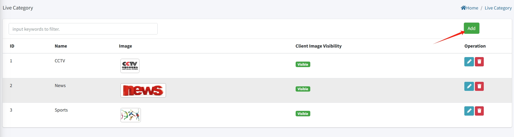

# Live Setting

>Introduction

The Program menus allows administrators to create, modify, and delete live channels and catchup setting. Administrators can upload corresponding images to match the covers of live channels. 

## Live Category

>Introduction

In the Live Category feature, administrators can create, modify, and delete categories for live channel sources. By creating Live categories, administrators can better organize and associate the corresponding live channel sources with the respective categories. This allows subscribers to conveniently search and categorize the live channels they want to watch.

Administrators can create new live categories by clicking on the "Add" button. Each channel category needs to be associated with a corresponding live channel source; each channel category can upload poster to specify their different.

## Live Program

>Introduction

In the "Live Program" section, you need to make some critical settings. This step is crucial because your input program source must strictly comply with Hooray IPTV's input standards and protocols.

First, you need to determine whether your program source meets Hooray IPTV's input standards. These standards may include specific file formats, encoding methods, resolutions, etc. If your program source does not meet these standards, you may need to use a transcoding tool to convert it to a format that complies with the standards.

Second, you need to ensure that your live channel source complies with Hooray IPTV's protocol. This may include how to transmit data, how to handle errors, how to ensure data integrity, etc.

If your program source does not comply with Hooray IPTV's input standards and protocols, the system will not function correctly. In this case, you may need to look for other live channel sources or seek hooray team with professional technical support to solve the problem.

Administrators can create new live channel by clicking on the "Add" button. 
# Catch-up Setting

