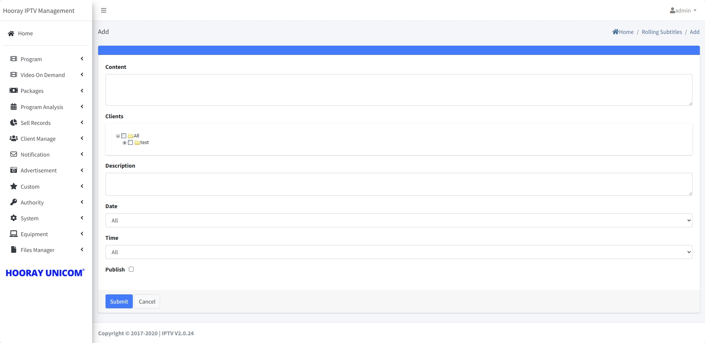

# Push Message Setting

>Introduction

 

The IPTV server has two types of message push methods, the first is `Rolling Subtitles`, where scrolling subtitles scroll from right to left at the top of the screen. The second is `Email` form, after sending the message, Email appears as a reminder message, users need to click to view its details.

## Email 

>Introduction

  

In the IPTV system, it is possible to send a message in the form of an Email, which can be pushed directly to the corresponding customer, and the customer needs to confirm and open it in the terminal to view the details.

Press `Add` button to create the `Email Message`

**Client**: In `Client`, select a group or specify a subscriber to send email message.

**Title**: The `Title` is used to display the subject of the email.

**Content**: Enter the content to be sent in Content

## Rolling Subtitles 

>Introduction

In IPTV system, the administrator can send different contents of rolling subtitles for different Subscriber groups, and the rolling subtitles can be set with font color and background color.

Press `Add` button to create the `Rolling Subtitles`

**Content**:Enter the content to be sent in `Content`

**Client**: In `Client`, select a group or specify a subscriber to send rolling subtitle.

**Description**:Describe the details of this rolling subtitle

**Date**: In `Date`, the administrator can specify the start date and end date of the rolling subtitle.

**Time**: In `Time`, the administrator can specify the start time and end time of the rolling subtitle.

