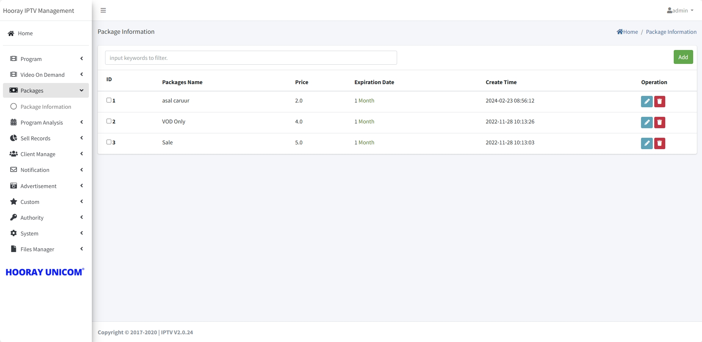
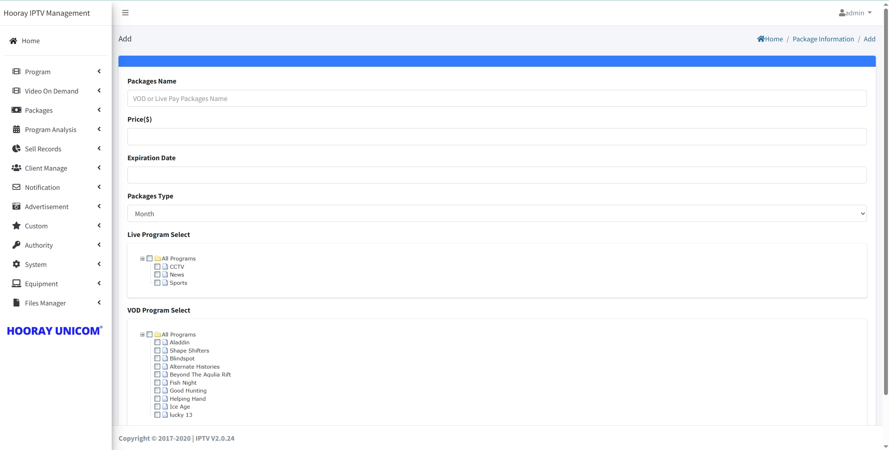

# Subscriber Packages Setting

>Introduction

In the Package Information page, administrators can create packages to be sold to customers, which contain package name, package price, package validity and live and on-demand binding information.Through Operation, the administrator can edit the created packages and delete the corresponding packages.

By clicking the `Add` button, the administrator can create a new package.

1. **Package Name**: The `Package Name` is used to display the package identification.

2. **Price**: The `Price` is used to identify the price of the package.

3. **Expiration Date**: Enter the package expiration number in `Expiration Date`, you need to work with and `Pakcage Type`, for example, the package expiration time is 1 Month, then enter the number `1` in `Expiration Date`, and select `Month` in `Package Type`, then the combination is 1 Month expiration time.

4. **Packages Type**: `Package Type` selects the period of validity of the package, and selects the corresponding unit in `Day`, `Month` and `Year`and how to match the number entered in `Expiration Date`.

5. **Live Program Select**: Select the live program bound to the corresponding package in `Live Program Select`.

5. **VOD Program Select**: Select the movies bound to the corresponding package in `VOD Program Select`.

