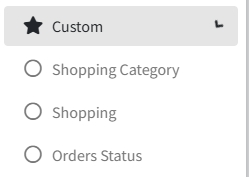

# Online Shopping Setting

>Introduction

 

In the `Custom menu`, administrators set up online sales product categories and product details, as well as view and manipulate order status.

## Shopping Category

>Introduction

 

In the `Shopping Category`, the administrator creates, modifies and deletes item categories.

Press `Add` button to create the new item category

**ID**: In `ID`, The IPTV system automatically creates an ID number, which is used to sort the different categories, the smaller the number, the more advanced the display is

**Name**: The `Name` is used to display the subject of the category.

## Shopping

>Introduction

On the `Shopping` page, the administrator needs to maintain the products in the online shopping mall and handle the specified products by creating, editing and deleting operations.

Press `Add` button to create the new item for online shopping.

**Image**: In `Image`, Upload product images in Image and the images are displayed on the terminal, currently only one image upload is supported.

**Name**: `Name` is used to identify the name of the product displayed in the terminal.

**Price**: In `Price`, it is used to display the unit price at which the product is sold.

**Shopping Category**: Select the `Shopping Category` for the product, and the product will appear in the corresponding category list on the terminal.

**Description**: In `Description` is used to describe specific information and details about this product.

## Order Status

>Introduction

 

In this page the administrator can view the details of the item order sent by the subscriber from the terminal. When the administrator receives the subscriber's order, he or she can `receive` the order by using the RECEIVE button or `cancel` the subscriber's order by using the DELETE button. After accepting the subscriber's order, when the order is completed, the administrator can click Finish button again to `complete` the whole order process.

