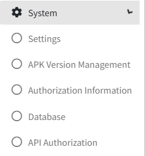

# System Setting

>Introduction

 

In `System`, the administrator can modify the IPTV system information, including the import of authorization information, the database being backed up, and the security settings of external API interface.

## Setting

 

In `Setting`, the administrator configures the basic information that needs to be synchronized to the terminal, the background image of each hierarchical page, Time Format and some other detailed parameters.

**Monetary Unit**: In the `Monetary Unit`, the administrator enters the local equivalent of the dollar sign, which is used to display the local dollar sign in Shopping.

**Description**: In `Time Format`, the administrator enters the local Time Format in order to display the local format in the terminal.

**Request ring**: In `Request ring`, the administrator uploads the corresponding order alert tone. Currently deprecated due to browser technical factors.

**Welcome Background**: In `Welcome Background`, the administrator needs to upload the welcome background picture which will be synchronized to the TV side.

**Home Background**: In `Home Background`, the administrator needs to upload the home background picture which will be synchronized to the TV side.

**Description**: In `Description`, the administrator sets the corresponding administrative role description information, which is used to describe what permissions the role has.

**Authority**: In Authority, the administrator needs to check the permissions that this administrative role has. Permissions can be divided up into View/Add/Edit/Delete

**Remarks**: In `Remark`, the administrator fills in the information that needs to be remarked for that role.