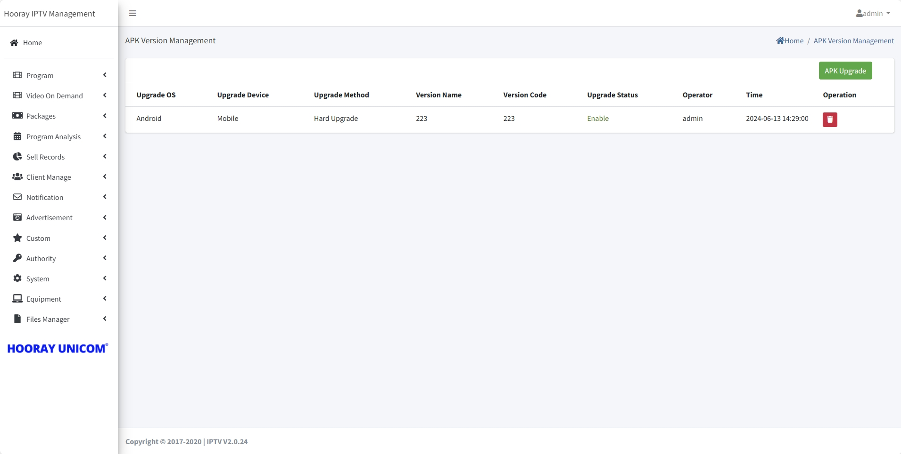
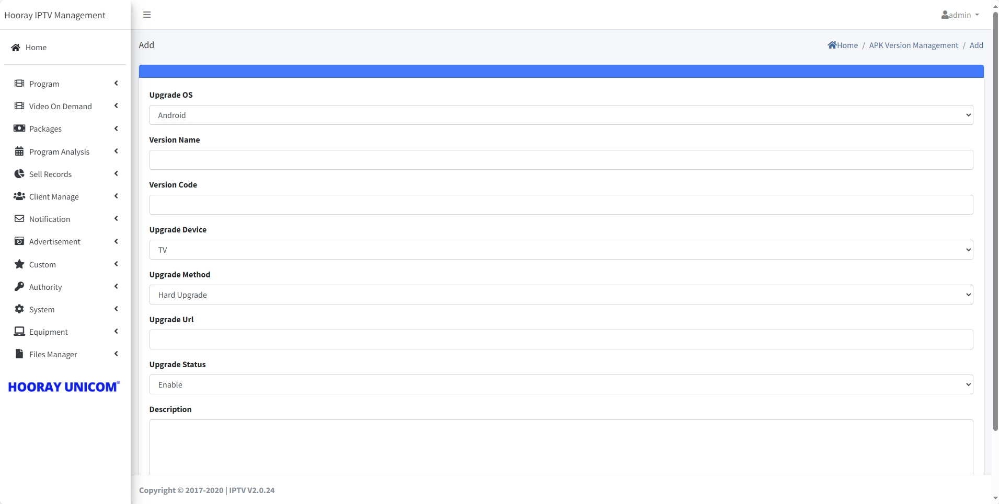
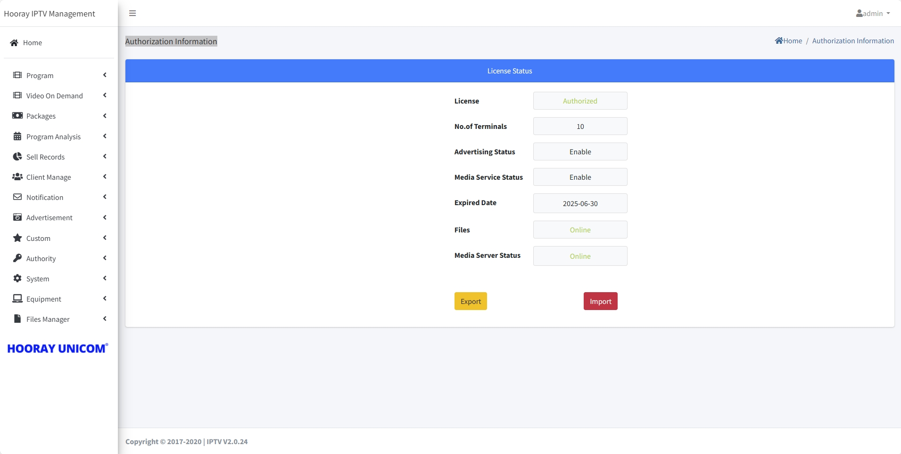

# System Setting

>Introduction

 

In `System`, the administrator can modify the IPTV system information, including the import of authorization information, the database being backed up, and the security settings of external API interface.

## Setting

>Introduction

 

In `Setting`, the administrator configures the basic information that needs to be synchronized to the terminal, the background image of each hierarchical page, Time Format and some other detailed parameters.

**Monetary Unit**: In the `Monetary Unit`, the administrator enters the local equivalent of the dollar sign, which is used to display the local dollar sign in Shopping.

**Description**: In `Time Format`, the administrator enters the local Time Format in order to display the local format in the terminal.

**Request ring**: In `Request ring`, the administrator uploads the corresponding order alert tone. Currently deprecated due to browser technical factors.

**Welcome Background**: In `Welcome Background`, the administrator needs to upload the welcome background picture which will be synchronized to the TV side.

**Home Background**: In `Home Background`, the administrator needs to upload the home background picture which will be synchronized to the TV side.

**Secondary Menu Background**: In `Secondary Menu Background`, the administrator needs to upload the secondary menu background picture which will be synchronized to the TV side.

**LOGO**: In `LOGO`, the administrator needs to upload the logo picture which will be synchronized to the TV and mobile side.

**Live Player Watermark**: This feature is currently deprecated.

**Vod Player Watermark**: This feature is currently deprecated.

**City**: In `City`, the administrator inputs the corresponding city name, and the IPTV server will get the weather information and forward it to different terminals.

**Enable Remote Assistance**: This feature is currently deprecated.

## APK Version Management

>Introduction

In APK Version Management. Administrators can configure upgrade policies for different terminals, supporting both mandatory and non-mandatory upgrade methods.

Press `Add` button to create the upgrade policies.

**Upgrade OS**: In the `Upgrade OS`, the administrator selects the device system to be upgraded. Android and iOS are currently supported.

**Version Name**: In `Version Name`. The administrator enters the name of this upgrade policy, which is used to distinguish between different policies.

**Version Code**: In `Version Code`, fill in the APK version number of the current upgraded version. When the terminal departs from the upgraded API, it will compare its own version number and the version number in the API, and if the version number in the API is higher than the version number of the terminal itself, it will download and install the new version.

**Upgrade Device**: In `Upgrade Device`, the administrator needs to upgrade the corresponding device type.

**Upgrade Method**: In `Upgrade Method`, the administrator needs to configure the upgrade method, mandatory upgrade means that the device must be upgraded to the current version number in order to continue whether or not, otherwise you can not log in to continue to use the service, non-mandatory means that the device does not need to be upgraded to continue to use the service, so that subscribers can choose whether to upgrade or not.

**Upgrade Url**: In `Upgrade Url`, the administrator needs to fill in the HTTP address where the latest version of the APK can be downloaded from the server.

**Upgrade Status**: In `Upgrade Status`, the administrator needs to choose whether to enable this upgrade policy.

**Description**: In `Description`, the administrator needs to fill in the description of this upgrade, which will be displayed when the terminal is upgraded.

## Authorization Information

>Introduction

In Authorization Information, administrators can view the current IPTV system License status and support export and import license files.

!> :warning:  Press `Export` to export the key file from IPTV system, the kye file need to send back to hooray, we will generate the license file to you.

!> :warning:  Press `Import` to import the license file from hooray provide, the IPTV system will activate from the license file.

