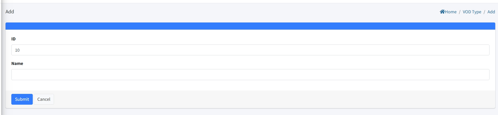

# Video On Demand Setting

>Introduction

The `Video On Demand menu` allows administrators to create, modify, and delete `VDO Category`, `VOD Program` and `VOD Upload` settings.

## VOD Category

>Introduction

In the `VOD Category` feature, administrators can create, modify, and delete categories for movies. By creating VOD categories, administrators can better organize and associate the corresponding movies with the respective categories. This allows subscribers to conveniently search and categorize the movies they want to watch.

Administrators can create new `VOD category` by clicking on the `Add` button. 

1. **ID**: This `ID` is automatically generated by the system and can be manually edited. When manually editing, it should not conflict with other ID. This `ID` is the VOD category sequence number, and the lower the ID number, the earlier the VOD category will be displayed on the set-top box for VOD menu.

2. **Name**: The `Name` is mainly used for displaying the VOD category name on the set-top box.

## VOD Program

>Introduction

S